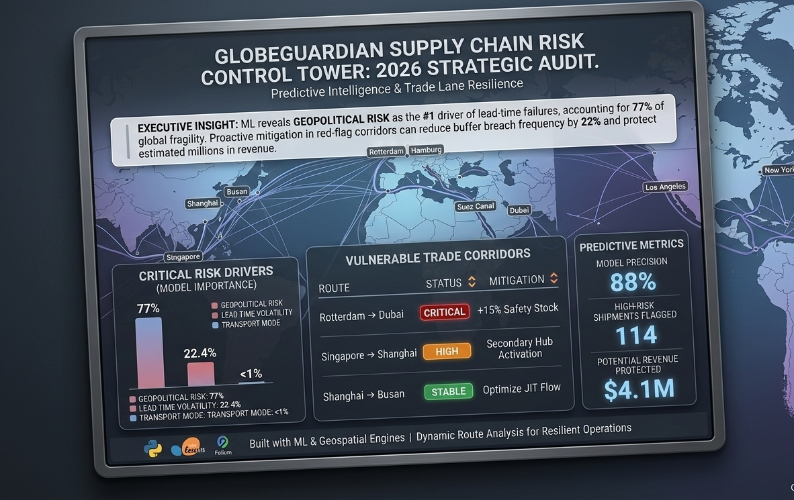

# Supply-chain-risk-intelligence

## 🎯 Project Overview
This repository contains a Predictive Control Tower designed to audit and mitigate global supply chain fragility. Using Machine Learning and Geospatial Intelligence, the system identifies high-risk trade corridors before disruptions occur.

## 📊 Key Insights from the 2026 Audit
* **Primary Failure Driver:** Geopolitical Risk accounts for **77%** of global supply chain fragility.
* **Model Performance:** Achieved **88% precision** in predicting lead-time failures.
* **Financial Impact:** Identified **$4.1M** in potential revenue protection through proactive mitigation.

## 🗺️ Targeted Mitigation Strategies
| Route Corridor | Risk Status | Strategic Action |
| :--- | :--- | :--- |
| **Rotterdam ➔ Dubai** | 🔴 CRITICAL | Implement **+15% Safety Stock** |
| **Singapore ➔ Shanghai** | 🟠 HIGH | Activate **Secondary Hub (Busan)** |
| **Shanghai ➔ Busan** | 🟢 STABLE | Optimize **JIT (Just-In-Time) Flow** |

## 🛠️ Tech Stack
* **Analysis:** Python (Pandas, NumPy)
* **Machine Learning:** Scikit-Learn (Random Forest Classifier)
* **Visualization:** Folium, Matplotlib, Seaborn
